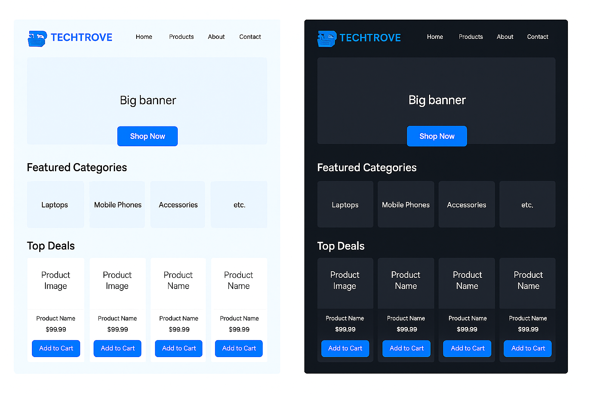
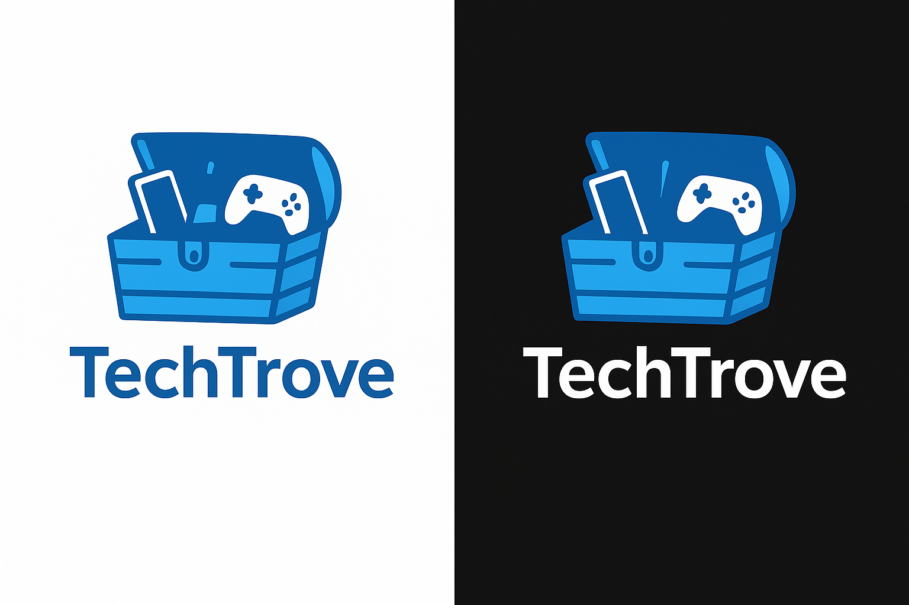

# Tech Trove

Tech Trove is a modern and responsive online store for gaming products and gadgets, built with **HTML**, **CSS**, and **JavaScript**.

## Overview

Tech Trove offers a clean, user-friendly interface to browse and order gaming PCs, laptops, and headsets. The site is responsive for desktop and web browsers (not specifically mobile-friendly at this stage).

## Screenshots


*Homepage Preview*


*Tech Trove Logo*

## Features

- **Responsive Web Design**: Adapts to various desktop and browser sizes.
- **Modern UI**: Clean and intuitive interface.
- **Product Catalog**: Browse gaming PCs, laptops, and headsets.
- **Order Form**: Simple order submission with validation.

## Project Structure

```
/project-root
│── index.html                (Main homepage)
│
│── src/
│   └── assets/
│       ├── images/           (Product images)
│       └── readme-images/    (Screenshots for README)
│           ├── tech-trove-homepage.png
│           └── tech-trove-logo.png
│
│   └── pages/
│       ├── products.html     (Product listings)
│       └── order.html        (Order form)
│
│── styles.css                (Custom styles)
│── script.js                 (JavaScript for form validation)
```

## Installation & Usage

1. Clone the repository:
   ```sh
   git clone https://github.com/yourusername/tech-trove.git
   ```
2. Open `index.html` in your browser.

## Technologies Used

- **HTML5** - Structure of the website.
- **CSS3** - Styling and responsive design.
- **JavaScript** - Form validation and interactivity.
